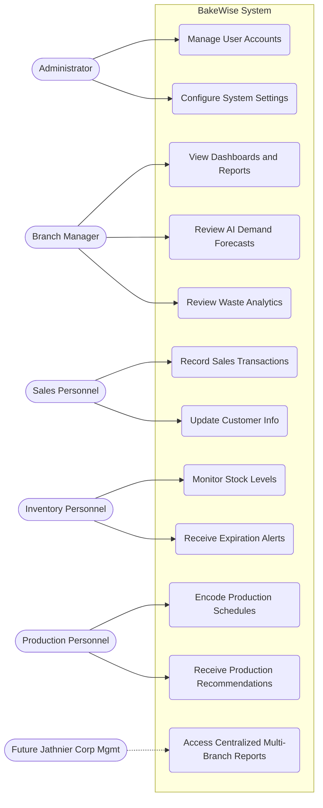
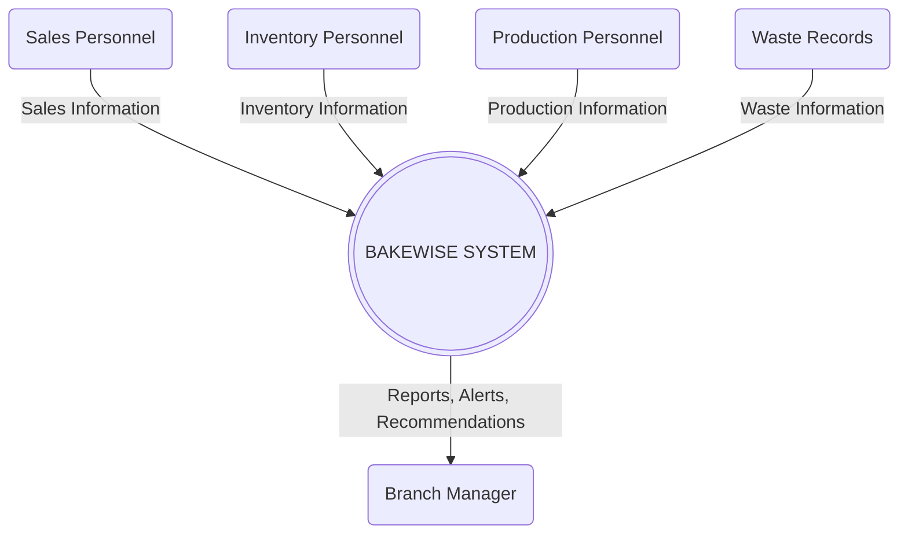
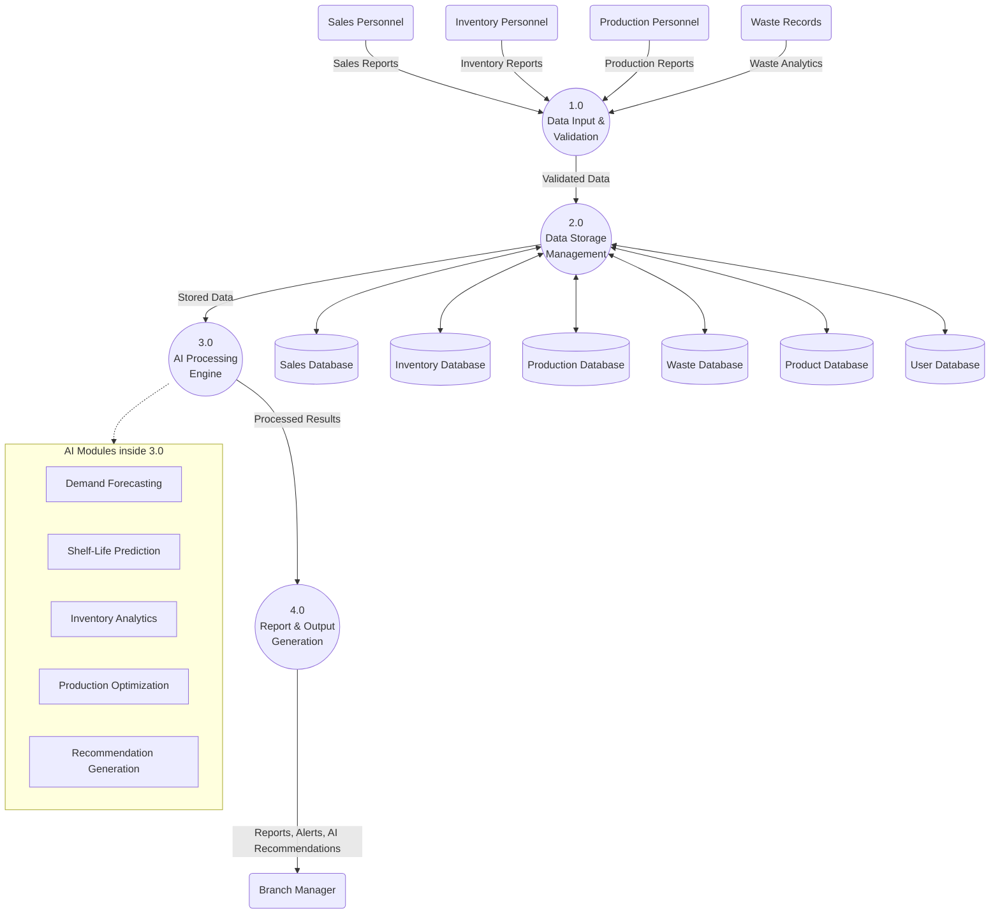
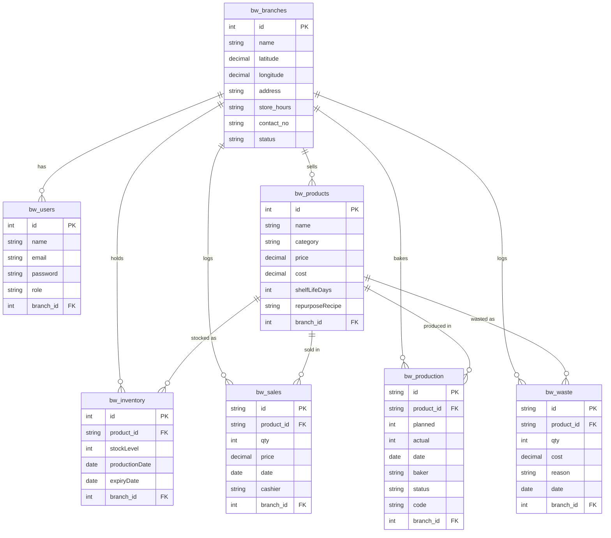

# BakeWise System Diagrams

This document contains the visual diagrams that illustrate the architecture, processes, and structure of the BakeWise System, developed in accordance with the System Design methodology. 

You can render these diagrams using any standard Markdown viewer that supports Mermaid.js (like GitHub, VS Code, or Notion).

## 1. Conceptual Framework (IPO)

```mermaid
flowchart LR
    subgraph Input ["INPUT"]
        I1[Sales Data]
        I2[Production Data]
        I3[Inventory Data]
        I4[Waste Records]
        I5[Product Information]
        I6[User Information]
    end

    subgraph Process ["PROCESS"]
        P1[Data Collection]
        P2[Database Storage]
        P3[AI Data Processing]
        P4[Demand Forecasting]
        P5[Shelf-Life Prediction]
        P6[Inventory Analytics]
        P7[Production Optimization]
        P8[Recommendation Generation]
    end

    subgraph Output ["OUTPUT"]
        O1[Forecast Reports]
        O2[Inventory Insights]
        O3[Alerts]
        O4[AI Recommendations]
        O5[Management Dashboard]
    end

    subgraph Benefits ["BENEFITS"]
        B1[Reduced Bread Waste]
        B2[Improved Operational Efficiency]
        B3[Better Decision-Making]
        B4[Sustainable Bakery Operations]
    end

    Input --> Process
    Process --> Output
    Output --> Benefits

    style Input fill:#e1f5fe,stroke:#311b92,stroke-width:2px
    style Process fill:#fff3e0,stroke:#e65100,stroke-width:2px
    style Output fill:#e8f5e9,stroke:#1b5e20,stroke-width:2px
    style Benefits fill:#fce4ec,stroke:#004d40,stroke-width:2px
```



## 2. Use Case Diagram



## 3. Context Flow Diagram (DFD Level 0)



## 4. Data Flow Diagram (DFD Level 1)



## 5. Entity Relationship Diagram (ERD)



## 6. Activity Diagram (AI Demand Forecasting & Repurposing)

```mermaid
flowchart TD
    Start([Start Daily Operations]) --> ViewDash[User accesses Management Dashboard]
    
    subgraph Forecasting [Demand Forecasting Process]
        ViewDash --> ReqForecast[System requests Forecast for Product]
        ReqForecast --> FetchSales[Fetch 6-12 Months Historical Sales]
        FetchSales --> Train[Python Model (Random Forest) Analyzes Data]
        Train --> Pred[Generate Predicted Demand Quantity]
    end

    subgraph Inventory_ShelfLife [Inventory & Shelf-Life Process]
        Pred --> EvalInv[System evaluates current Inventory Levels]
        EvalInv --> ChkExpiry[System checks Expiry Dates]
        ChkExpiry -->|Freshness < 30%| Repurpose[Generate Product Repurposing Alert]
        ChkExpiry -->|Freshness >= 30%| Optimize[Calculate Net Production Requirement]
    end

    Repurpose --> Display
    Optimize --> Display[Display Production Recommendations on Dashboard]

    Display --> Review[Branch Manager Reviews AI Suggestions]
    Review --> End([End Daily Planning])
```

## 7. System Architecture Design

```mermaid
flowchart TD
    subgraph UserLayer ["1. User Layer (Client-Side Interface)"]
        Browser[Web Browser / Device]
        Sales[Sales Interface]
        Inv[Inventory Interface]
        Prod[Production Interface]
        Dash[Management Dashboard]
    end

    subgraph AppLayer ["2. Application Layer (Backend Server)"]
        Node[Node.js / Express.js Server]
        Auth[User Authentication Module]
        Logic[Business Logic Modules]
    end

    subgraph AILayer ["3. Artificial Intelligence Layer"]
        Python[Python Microservice]
        RF[Random Forest Algorithm]
        DataPrep[Data Preprocessing (Pandas/Scikit-learn)]
    end

    subgraph DataLayer ["4. Database Layer"]
        DB[(MySQL Database)]
        DB_Sales[(Sales Tables)]
        DB_Inv[(Inventory Tables)]
    end

    %% Connections
    Browser --> Node
    Sales --> Node
    Inv --> Node
    Prod --> Node
    Dash --> Node

    Node <--> Auth
    Node <--> Logic

    Logic <--> DB
    DB <--> DB_Sales
    DB <--> DB_Inv

    Logic -- "Triggers Prediction Script" --> Python
    Python <--> DataPrep
    DataPrep <--> RF
    RF -- "Returns Forecast Results" --> Logic
```
