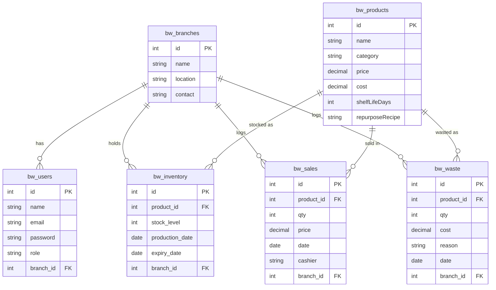

# BakeWise System Diagrams

## 1. Entity Relationship Diagram (ERD)



## 2. Use Case Diagram

```mermaid
usecaseDiagram
    actor Admin
    actor Manager
    actor Staff

    rectangle "BakeWise System" {
        usecase "Manage Branches" as UC1
        usecase "Manage Staff" as UC2
        usecase "Manage Products" as UC3
        usecase "Log Sales" as UC4
        usecase "Manage Inventory" as UC5
        usecase "Log Waste" as UC6
        usecase "View AI Analytics" as UC7
        usecase "Generate Reports" as UC8
        usecase "View Repurposing Alerts" as UC9
    }

    Admin --> UC1
    Admin --> UC2
    Admin --> UC3
    Admin --> UC4
    Admin --> UC5
    Admin --> UC6
    Admin --> UC7
    Admin --> UC8
    Admin --> UC9

    Manager --> UC3
    Manager --> UC4
    Manager --> UC5
    Manager --> UC6
    Manager --> UC7
    Manager --> UC8
    Manager --> UC9

    Staff --> UC4
    Staff --> UC5
    Staff --> UC6
```

## 3. Activity Diagram (AI Demand Forecasting)

```mermaid
activityDiagram
    start
    :User navigates to AI Analytics Pane;
    :Frontend requests /api/forecast;
    :Node.js retrieves Historical Sales from Database;
    :Node.js executes Python Script;
    if (Sales Data exists?) then (yes)
        :Python script formats data;
        :Python trains Random Forest Model;
        :Python predicts next day demand;
    else (no)
        :Python returns default baseline prediction;
    endif
    :Node.js sends JSON back to Frontend;
    :Frontend calculates Recommended Bake Quantity;
    :Frontend renders Chart and Recommendations;
    stop
```
